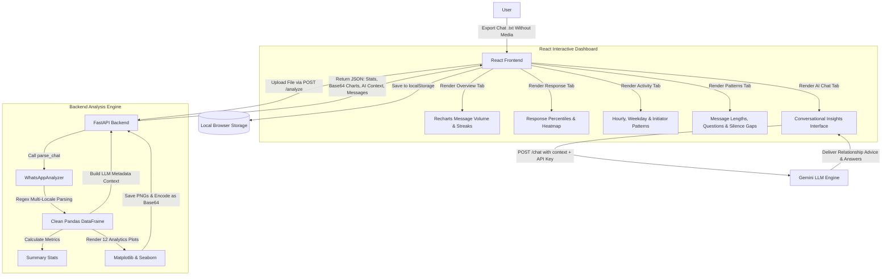

#                                                             Wingman
Wingman is a local-first, privacy-respecting WhatsApp Chat Analyzer featuring a high-performance Python analytics engine, a polished React dashboard with rich interactive visualizations (Recharts, TailwindCSS), and a context-aware Gemini LLM relationship assistant.

The platform is designed to take exported WhatsApp chat logs (`.txt` files), parse message histories with automatic locale and format detection, generate deep behavioral analytics, render visual performance heatmaps/charts, and let you conversationally grill your chat data.


---

## High-Level Architecture



---

## What This Repo Contains

- `backend/` - FastAPI web app containing endpoints, parsing scripts, and Matplotlib-based plotting scripts
  - [main.py](file:///c:/Users/bhara/Desktop/Projects/Wingman/backend/main.py) - API router exposing endpoints for chat analysis (`/analyze`), AI conversation (`/chat`), and health checks (`/health`)
  - [analyzer.py](file:///c:/Users/bhara/Desktop/Projects/Wingman/backend/analyzer.py) - Core data processing script implementing the `WhatsAppAnalyzer` class, regex format extraction, and statistical plotting
- `frontend/` - React dashboard powered by Vite, TailwindCSS, and Recharts
  - [src/App.jsx](file:///c:/Users/bhara/Desktop/Projects/Wingman/frontend/src/App.jsx) - Main entrypoint routing between file upload and dashboard view with built-in dark mode transitions
  - [src/components/upload/UploadPage.jsx](file:///c:/Users/bhara/Desktop/Projects/Wingman/frontend/src/components/upload/UploadPage.jsx) - Drag-and-drop file interface for uploading exports
  - [src/components/dashboard/Dashboard.jsx](file:///c:/Users/bhara/Desktop/Projects/Wingman/frontend/src/components/dashboard/Dashboard.jsx) - Shell containing sidebar navigation, statistics counters, and theme toggles
  - [src/components/dashboard/sections/Sections.jsx](file:///c:/Users/bhara/Desktop/Projects/Wingman/frontend/src/components/dashboard/sections/Sections.jsx) - Section templates splitting metrics into Overview, Response, Activity, and Patterns views
  - [src/components/dashboard/charts/](file:///c:/Users/bhara/Desktop/Projects/Wingman/frontend/src/components/dashboard/charts/) - Directory containing granular Recharts visualization modules (streaks, gaps, volume, response percentiles)
  - [src/components/ai/AIChat.jsx](file:///c:/Users/bhara/Desktop/Projects/Wingman/frontend/src/components/ai/AIChat.jsx) - LLM-powered chatbot utilizing the generated analysis context for relationship-focused questioning
- `README.md` - this guide

---

## Core Flow

1. **Submit Chat Log**: The user drops an exported `.txt` chat log (without media) into the frontend interface.
2. **Auto-Format Detection**: The `backend` parsing module executes a voting protocol on unambiguous dates in the first 200 lines to determine if the date format is day-first (DD/MM) or month-first (MM/DD), adjusting regex formats automatically.
3. **Behavioral Analysis**: The backend extracts timestamps, senders, and message texts into a Pandas DataFrame, excluding automated system notifications, and computes:
   - **Response Times**: Compares timestamps between alternating senders.
   - **Double-Texting**: Computes consecutive message clusters sent by a single participant before a reply.
   - **Conversation Initiators**: Identifies who starts a chat thread after a gap of >6 hours.
   - **Speech Habits**: Computes average character counts and question frequencies (messages containing `?`).
   - **Streaks & Gaps**: Track daily messaging streak counts and find the longest silence gaps.
4. **Matplotlib Visualizations**: Renders 12 analytical plots (histograms, bar plots, heatmaps, pie charts) and returns them base64-encoded to the frontend.
5. **Local-First Caching**: The frontend receives the JSON response and caches the analysis data locally. Subsequent visits load instantly without backend round-trips.
6. **Gemini Insights**: When the user opens the **AI Chat** tab, the frontend provides the statistical summary as context. The chat interface prompts the user for a Gemini API key (cached securely in `localStorage`) and pipes questions directly to `/chat` where Gemini analyzes conversational habits, ghosting streaks, and communication symmetry.

---

## Service Layout & Technology Stack

| Layer | Service Folder | Technology / Packages |
|---|---|---|
| **Frontend UI** | `frontend/` | React 18, Vite, React Router, Recharts, TailwindCSS, Lucide Icons |
| **API & Analysis Server** | `backend/` | FastAPI, Python-Multipart, Pandas, Matplotlib, Seaborn, Dateutil, Python-Dotenv |
| **AI Processing** | Local / Cloud | Google GenAI SDK (`gemini-3.1-flash-lite-preview` model) |
| **Data Persistence** | Local Browser | Web Storage API (`localStorage`) |

---

## Local Setup

### Prerequisites

- Python 3.10+ installed
- Node.js 18+ installed
- Gemini API key (available at [Google AI Studio](https://aistudio.google.com/))

---

### Step 1: Boot Backend API Server

Open a terminal session to set up the Python virtual environment and run the API:

```bash
cd backend
python -m venv venv

# Windows (PowerShell)
venv\Scripts\Activate.ps1
# Mac/Linux
source venv/bin/activate

# Install libraries
pip install -r requirements.txt

# Run server on port 8000
uvicorn main:app --reload --port 8000
```
The backend API is now running at `http://localhost:8000`. You can inspect endpoints and run test queries via Swagger UI at `http://localhost:8000/docs`.

---

### Step 2: Configure & Start Frontend App

Open a second terminal session to boot the React frontend:

1. Navigate to the `frontend/` directory and install dependencies:
   ```bash
   cd frontend
   npm install
   ```
2. Create a `.env` configuration file inside `frontend/`:
   ```env
   VITE_API_URL=http://localhost:8000
   ```
3. Boot the Vite development server:
   ```bash
   npm run dev
   ```
4. Open your browser and navigate to `http://localhost:5173` to start using Wingman.

---

## Exporting a WhatsApp Chat

To analyze your chats, you must first export a `.txt` transcription:

1. Open **WhatsApp** on your mobile device.
2. Select the specific chat you want to analyze (individual or group).
3. Tap the three dots (⋮) in the top-right corner → **More** → **Export Chat**.
4. Select **Without Media** (this is critical, as attachments alter the plain-text parser layout).
5. Send or save the `.txt` file to your computer.
6. Upload the file to Wingman to view stats instantly!

---

## Operational Details

- **Privacy-First Design**: Your raw conversation logs are processed in memory and written temporarily as local files in `backend/analysis_outputs/` for graph generation. Chat histories are saved entirely inside your browser's local storage—no database stores your private messages.
- **Port Mapping**:
  - `http://localhost:8000` -> FastAPI Backend API Server
  - `http://localhost:5173` -> Vite / React Developer UI
- **Flexible Locale Parsing**: The parser supports complex date formatting (12-hour/24-hour schedules, slash/hyphen dates, and AM/PM notations) and automatically adapts to country-specific formats using its voting mechanism.
